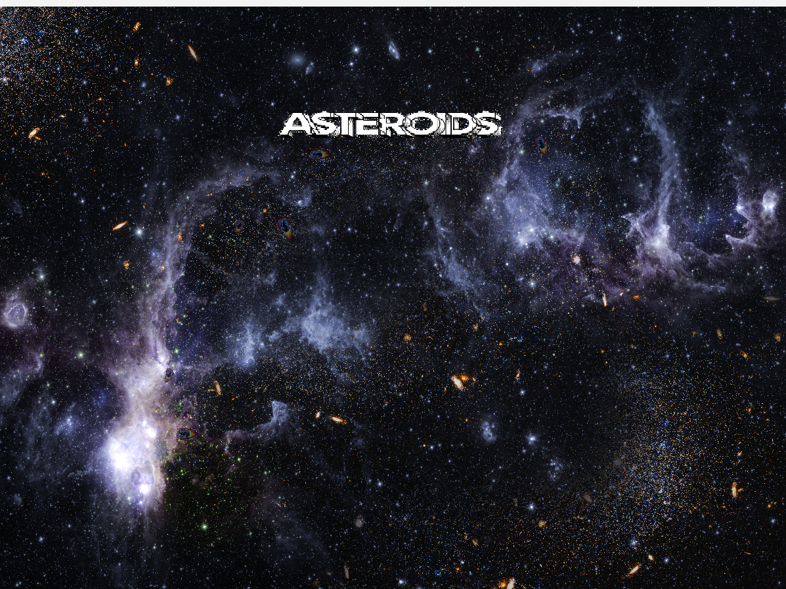
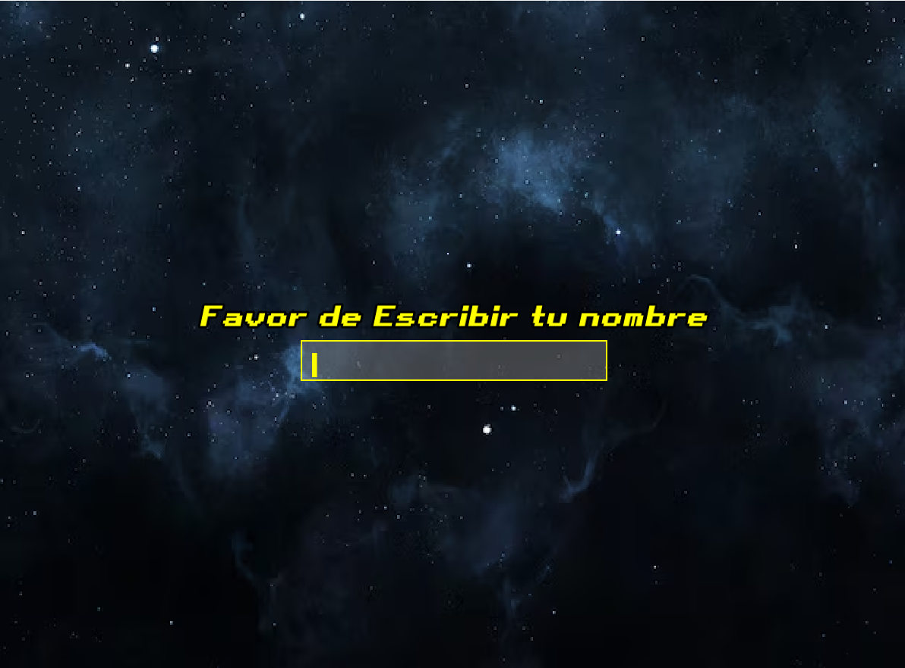
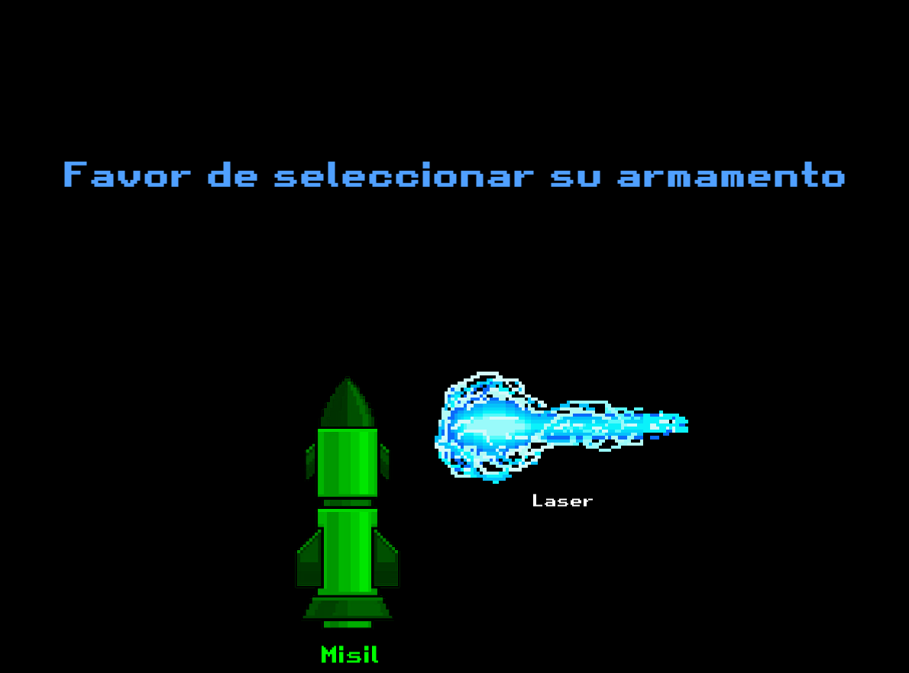
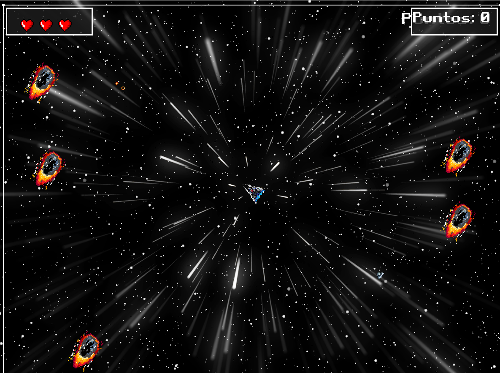
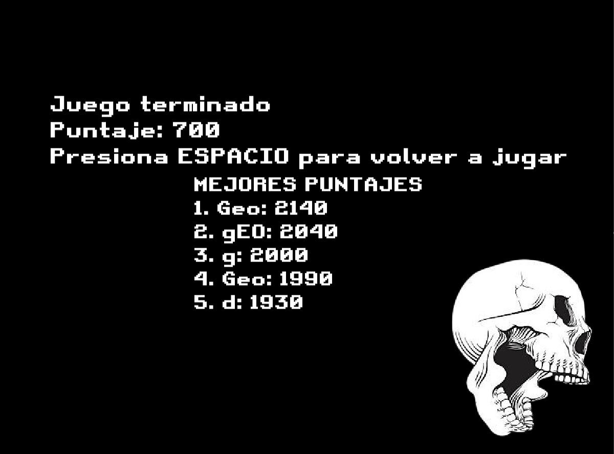

# 🚀 Asteroids - Juego Espacial Retro

> Un emocionante juego de Asteroids desarrollado en C++ con SFML, inspirado en el clásico arcade de los años 80

[](https://isocpp.org/)
[](https://www.sfml-dev.org/)
[](LICENSE)
[](https://www.microsoft.com/windows)

## 📖 Descripción

**Asteroids** es un juego de acción espacial donde controlas una nave que debe sobrevivir en un campo de asteroides hostil. Destruye asteroides para ganar puntos, evita las colisiones y aprovecha los power-ups que aparecen en el espacio. El juego presenta gráficos retro, efectos visuales impresionantes y una experiencia de juego adictiva.

## 📸 Capturas de Pantalla del Juego

### 🌟 Pantalla de Inicio

*Pantalla principal del juego con el título "Asteroids" y cometas animados de fondo*

### 👤 Ingreso de Usuario

*Interfaz para ingresar el nombre del jugador antes de comenzar*

### 🚀 Selección de Nave

*Menú para elegir entre diferentes diseños de naves espaciales*

### ⚔️ Selección de Armamento

*Pantalla para seleccionar el tipo de armamento (Misiles o Láser)*

### 📋 Instrucciones

*Pantalla de instrucciones con controles, power-ups e información del juego*

### 🎮 Partida en Curso

*Gameplay principal mostrando la nave, asteroides, HUD y puntuación*

### ⚫ Agujero Negro y Power-ups

*Agujero negro con efectos gravitacionales y power-ups especiales*

### 💀 Game Over

*Pantalla final con tabla de mejores puntajes y animación de calavera*

## ✨ Características Principales

### 🎮 Gameplay
- **Control fluido de la nave** con rotación y aceleración realista
- **Sistema de disparo múltiple** con diferentes tipos de armamento
- **Asteroides dinámicos** que se dividen en fragmentos más pequeños
- **Sistema de puntuación** progresivo con tabla de mejores puntajes
- **Power-ups especiales** como vida extra, escudo y doble disparo
- **Agujero negro** que aparece a los 600 puntos con efectos de atracción

### 🎨 Visuales y Audio
- **Gráficos pixel art** con estilo retro auténtico
- **Efectos de partículas** y explosiones animadas
- **Música de fondo** y efectos de sonido inmersivos
- **Interfaz de usuario** intuitiva con fuentes retro
- **Animaciones fluidas** de 60 FPS

### 🛠️ Características Técnicas
- **Programación Orientada a Objetos** con diseño modular
- **Detección de colisiones** precisa con diferentes formas geométricas
- **Sistema de estados** para menús, juego y game over
- **Gestión de recursos** eficiente para texturas y sonidos
- **Arquitectura escalable** fácil de modificar y extender

## 🎯 Objetivos del Juego

1. **Sobrevivir** el mayor tiempo posible en el campo de asteroides
2. **Destruir asteroides** para obtener puntos y limpiar el área
3. **Recoger power-ups** para mejorar tus capacidades
4. **Evitar colisiones** con asteroides y otros peligros
5. **Alcanzar la puntuación más alta** posible

## 🕹️ Controles

### Movimiento de la Nave
| Tecla/Mouse | Acción |
|-------------|--------|
| `W` / `↑` | Acelerar hacia adelante |
| `Mouse` | Apuntar la nave hacia el cursor (cuando no se usan las flechas) |

### Combate y Funciones
| Tecla/Mouse | Acción |
|-------------|--------|
| `Espacio` | Disparar misiles |
| `Click Izquierdo` | Disparar misiles |
| `Click Izquierdo` | Láser (mantener presionado, tiene tiempo de recarga de 2 segundos) |
| `ESC` | Pausar/Reanudar juego |
| `Enter` | Confirmar selecciones |

## 🛠️ Tecnologías Utilizadas

### Lenguajes y Librerías
- **C++17**: Lenguaje principal del proyecto
- **SFML 2.5+**: Simple and Fast Multimedia Library
  - `sfml-graphics`: Renderizado y gráficos
  - `sfml-window`: Gestión de ventanas y eventos
  - `sfml-system`: Utilidades del sistema
  - `sfml-audio`: Reproducción de audio

### Herramientas de Desarrollo
- **MinGW-w64**: Compilador GCC para Windows
- **Make**: Sistema de construcción
- **Git**: Control de versiones
- **Visual Studio Code**: Editor recomendado

## 📦 Instalación y Configuración

### Prerrequisitos
1. **MinGW-w64** instalado y configurado en PATH
2. **SFML 2.5+** instalado en el sistema
3. **Make** disponible en la línea de comandos

### Pasos de Instalación

1. **Clonar el repositorio**:
   ```bash
   git clone https://github.com/tu-usuario/Asteroids.git
   cd Asteroids
   ```

2. **Compilar el proyecto**:
   ```bash
   make
   ```

3. **Ejecutar el juego**:
   ```bash
   make runAsteroids
   # o directamente
   ./Asteroids.exe
   ```

### Comandos del Makefile

| Comando | Descripción |
|---------|-------------|
| `make` | Compila el proyecto completo |
| `make runAsteroids` | Compila y ejecuta el juego |
| `make clean` | Limpia archivos de compilación |

## 🏗️ Estructura del Proyecto

```
Asteroids/
├── 📁 src/              # Código fuente
│   ├── Asteroids.cpp    # Punto de entrada principal
│   ├── Ventana.cpp      # Gestión de la ventana y loops principales
│   ├── Nave.cpp         # Lógica de la nave del jugador
│   ├── Misil.cpp        # Proyectiles y armamento
│   ├── Asteroide.cpp    # Comportamiento de asteroides
│   ├── Explosion.cpp    # Efectos de explosión
│   └── ...              # Otros módulos
├── 📁 include/          # Archivos de cabecera
│   ├── Ventana.hpp
│   ├── Nave.hpp
│   └── ...
├── 📁 assets/           # Recursos del juego
│   ├── 🎵 music/        # Música y efectos de sonido
│   ├── 🖼️ images/       # Texturas y sprites
│   └── 🔤 fonts/        # Fuentes tipográficas
├── 📁 docs/             # Documentación
├── makefile             # Script de compilación
└── README.md            # Este archivo
```

## 🎨 Assets y Recursos

### Gráficos
- **Sprites de naves**: Múltiples diseños seleccionables
- **Asteroides**: Diferentes tamaños y formas
- **Power-ups**: Vida extra, escudo, doble disparo
- **Efectos especiales**: Explosiones, agujero negro
- **Fondos**: Espacios estelares animados

### Audio
- **Música de fondo**: Soundtrack espacial ambient
- **Efectos de sonido**: Disparos, explosiones, power-ups
- **Audio de interfaz**: Sonidos de menú y confirmación

### Fuentes
- **Retro Gaming**: Fuente principal pixel art
- **Morally Serif**: Fuente decorativa

## 🎮 Modos de Juego

### 🏁 Modo Principal
- Supervivencia infinita con dificultad progresiva
- Sistema de puntuación acumulativa
- Aparición de power-ups aleatorios
- Tabla de mejores puntajes persistente

### ⚡ Características Especiales
- **Agujero Negro**: Aparece a los 600 puntos con efectos gravitacionales
- **Múltiples Armamentos**: Misiles, láser simple y doble
- **Power-ups Temporales**: Efectos limitados en el tiempo
- **Animaciones Dinámicas**: Efectos visuales reactivos

## 🏆 Sistema de Puntuación

| Acción | Puntos |
|--------|--------|
| Asteroide Grande | 20 puntos |
| Asteroide Mediano | 50 puntos |
| Asteroide Pequeño | 100 puntos |
| Power-up Recogido | 10 puntos |
| Supervivencia (por segundo) | 1 punto |

## 🔧 Desarrollo y Contribución

### Compilación para Desarrollo
```bash
# Compilación con información de debug
make debug

# Compilación optimizada para release
make release

# Ejecutar tests (si están disponibles)
make test
```

### Estructura de Clases Principales

```cpp
class Ventana {
    // Gestión de la ventana principal y estados del juego
    void Mostrar();
    void MostrarInicio();
};

class Nave {
    // Control de la nave del jugador
    void Mover(float deltaTime);
    void Disparar();
};

class Asteroide {
    // Comportamiento de asteroides
    void Actualizar();
    bool ColisionCon(const Nave& nave);
};
```

## 🐛 Solución de Problemas

### Problemas Comunes

1. **Error de compilación SFML**:
   ```bash
   # Verificar instalación de SFML
   pkg-config --libs sfml-all
   ```

2. **Archivos de audio no se reproducen**:
   - Verificar que los archivos .ogg estén en `assets/music/`
   - Comprobar códecs de audio instalados

3. **Texturas no se cargan**:
   - Verificar rutas de archivos en `assets/images/`
   - Comprobar formatos de imagen soportados (PNG, JPG)

### Logs de Debug
El juego genera mensajes de debug en la consola para ayudar con la resolución de problemas.

## 📚 Documentación Adicional

- [🔧 Guía de Instalación Detallada](docs/instalacion.md)
- [🎮 Manual del Usuario](docs/manual-usuario.md)
- [👨‍💻 Documentación para Desarrolladores](docs/desarrollo.md)
- [🎨 Guía de Assets](docs/assets.md)

## 🤝 Contribuir al Proyecto

¡Las contribuciones son bienvenidas! Para contribuir:

1. Fork el proyecto
2. Crea una rama para tu feature (`git checkout -b feature/AmazingFeature`)
3. Commit tus cambios (`git commit -m 'Add some AmazingFeature'`)
4. Push a la rama (`git push origin feature/AmazingFeature`)
5. Abre un Pull Request

### Tipos de Contribuciones
- 🐛 Reportes de bugs
- ✨ Nuevas características
- 📝 Mejoras en documentación
- 🎨 Nuevos assets gráficos
- 🔧 Optimizaciones de performance

## 🧑‍💻 Comandos Útiles: Git y CMD

### 📁 Comandos CMD (Windows)

| Comando | Descripción |
|---------|-------------|
| `cd [ruta]` | Cambia de directorio |
| `cd ..` | Sube un nivel en la jerarquía |
| `dir` | Lista contenido del directorio |
| `cls` | Limpia la pantalla |
| `mkdir [nombre]` | Crea una nueva carpeta |
| `del [archivo]` | Elimina un archivo |
| `rmdir [carpeta] /s` | Elimina carpeta y contenido |

### 🌱 Comandos Git Básicos

| Comando | Descripción |
|---------|-------------|
| `git clone [url]` | Clona repositorio remoto |
| `git status` | Muestra estado de archivos |
| `git add .` | Agrega archivos al staging |
| `git commit -m "Mensaje"` | Guarda cambios con mensaje |
| `git push` | Envía cambios al remoto |
| `git pull` | Descarga cambios remotos |
| `git log --oneline` | Historial de commits |
| `git checkout [rama]` | Cambia de rama |
| `git branch` | Lista ramas locales |

## 📄 Licencia

Este proyecto está licenciado bajo la **Licencia MIT**. Consulta el archivo [LICENSE](LICENSE) para más detalles.

```text
MIT License - Copyright (c) 2024 Ramon Cort
```

## 🙏 Agradecimientos

- **SFML Team** - Por la excelente biblioteca multimedia
- **Comunidad C++** - Por el apoyo y recursos
- **Atari** - Por el juego original que inspiró este proyecto
- **Contribuidores** - Por hacer este proyecto mejor

## 📞 Contacto y Soporte

- **GitHub Issues**: Para reportar bugs o solicitar features
- **Email**: [tu-email@example.com](mailto:tu-email@example.com)
- **Discord**: Tu servidor de Discord (si tienes)

---

<div align="center">

**⭐ Si te gusta este proyecto, no olvides darle una estrella ⭐**

Hecho con ❤️ por [Ramon Cort](https://github.com/RamonCort)

</div>